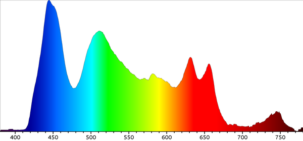

# RPi Spectrometer
Spectrometer for Raspberry Pi using a Pi Camera



This is a fully functioning spectrometer. It captures an image from a Pi camera with diffraction grating in front and will analyse spectrum and generate a nice tidy spectrograph chart as a PNG.

For more details please see blog post at [Durable Scope](http://blog.durablescope.com/post/BuiltASpectrometer/)

## Getting Started
Run ```docker build -t [your_desired_image_name] .```

Then ```docker run --device=/dev/vchiq -i -t [your_image_name_from_above] /bin/bash```

All of the files located in this directory will be mounted at ```/src```, run
```cd src``` to navigate there.

From here, all you have to do is run the capture command ```python3 spectrometer.py [file_name_for_images] [shutter_time_microseconds]``` eg. ```python3 spectrometer.py my_first_spectometer 100000```

## Deploying to a Pi Device
Take a micro-SD card and drop the source code from this repository onto a desired location.

Take SD-card and insert it into the Raspberry Pi device, connect via ssh or attached keyboard and monitor.

Follow the Dockerfile steps manually to install required dependencies and operate on the actual SD card OS.
